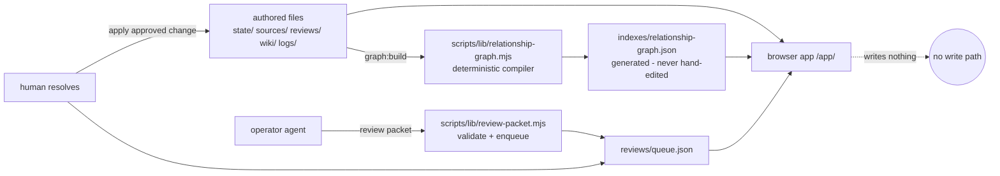

# Architecture

## Data flow

## The two file classes

**Authored** (source of truth, human- or gate-written): everything under `state/`, `sources/`, `reviews/`, `wiki/`, `logs/`, `runs/`.
**Generated** (pure function of authored files): everything under `indexes/`. Never edit by hand; CI rebuilds and diffs it.

## Vocabulary (one metaphor)

User-facing copy uses a single frame — a read-only **cockpit** over an **atlas** of **areas**. Internal identifiers keep their original names; the public-wording layer (`app/src/publicText.js`) rewrites the rest at render time, so the naming pass has one file to change.

| Internal term | User-facing term | Where enforced |
|---|---|---|
| district / region | area | `publicText.js` (render-time rewrite) |
| node | item | `publicText.js` |
| relationship / relation | connection | `publicText.js` |
| Brain / Assistant panel | Operator | renamed in the rendered copy |
| atlas / cockpit | atlas / cockpit (kept — the map and its shell) | — |

New UI copy should route domain nouns through `publicText()` and label the reasoning surface "Operator"; never introduce "brain" or "district" into visible text.

## Modules

| Module | Role | Notes |
|---|---|---|
| `app/src/state.js` | The app's entire I/O: 12 `fetch()` GETs of local JSON | One URL constant; the graph and the layout overlay are optional and degrade gracefully |
| `app/src/viewModel.js` | Builds the surface model (brief, areas, workspaces, graph view) | Large (~1.7k lines); split planned |
| `app/src/world.js` | Three.js scene: perspective camera over a 2.5D heightfield | Order-stable (id-sorted) radial layout, no RNG; honors `state/layout.json` pins; renders gold approval rings on areas touched by pending packets |
| `app/src/instruments.js` | DOM rendering: inspector, approvals, operator panel, palette | Largest module (~3.3k lines); split planned |
| `app/src/evidence.js` | Resolves source IDs → evidence trails, permission-aware actions | |
| `app/src/reviewDraft.js` | Builds review-packet *previews* in the browser — never persists | |
| `scripts/lib/relationship-graph.mjs` | Compiler: 11 input files → nodes/edges/clusters with provenance | Deterministic incl. `generated_at`; fallback source IDs are config, not constants |
| `scripts/lib/review-packet.mjs` | Pure validation + enqueue + resolution library (10 exports, no I/O) | Target allowlist is currently the queue file itself |

## The write gate

1. Anyone (human or agent) drafts a **review packet**: typed fields, `browser_writes: false`, `requires_explicit_approval: true`, risk level, undo path, source IDs that must exist in the catalog.
2. `create-review-queue-entry.mjs` validates the packet shape and target path, dedupes, and appends to `reviews/queue.json`.
3. The cockpit renders it as pending. A human resolves it via `resolve-review-queue-entry.mjs` (actor, reason, undo documented; side-effect fields rejected).
4. **Applying** the approved change to state files is an operator step, followed by `graph:build`. The browser never performs step 4 — that is the invariant the contract tests protect.

## Determinism

The compiler sorts nodes, edges, and clusters; derives `generated_at` from the max timestamp in the inputs; and uses no RNG, wall clock, or directory ordering. CI rebuilds the committed graph and fails on any byte difference. The map layout in `world.js` sorts nodes by id before placement, so identical data renders identical positions regardless of upstream array order; user pins in `state/layout.json` override computed positions entirely.

## Testing strategy

Python `unittest` guards file-shape contracts (state schemas, permissions matrix, board protocol, review lifecycle). Node verifiers assert graph semantics (`verify-relationship-graph.mjs`) and render-model behavior on synthetic fixtures (`verify-product-world-model.mjs`). `leak-scan.mjs` blocks secret-shaped or personal-path strings. Browser-level QA (Playwright) existed against a private workspace and is being rebuilt fixture-based — see the issue tracker.
